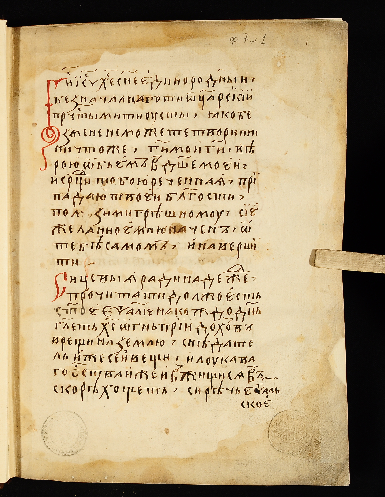
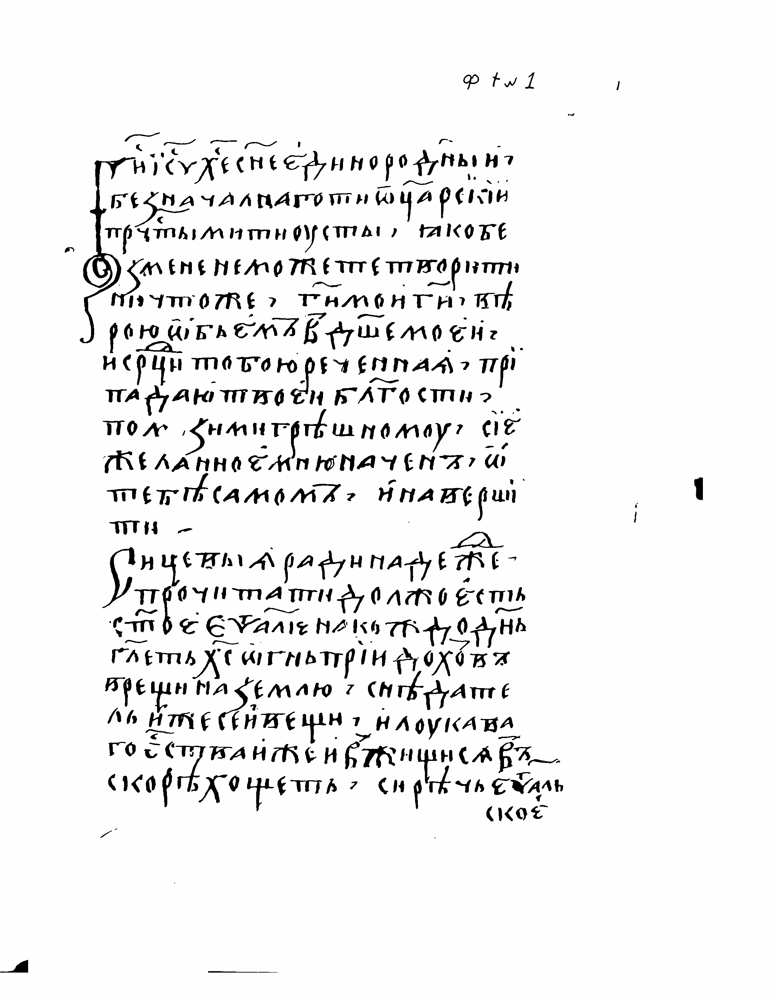
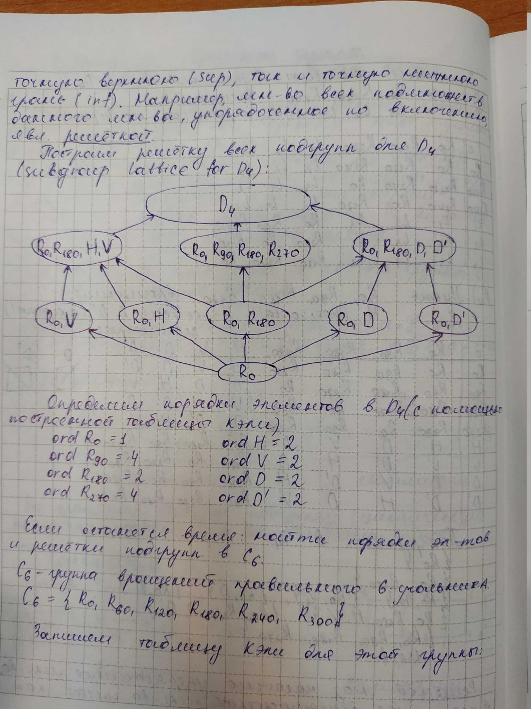
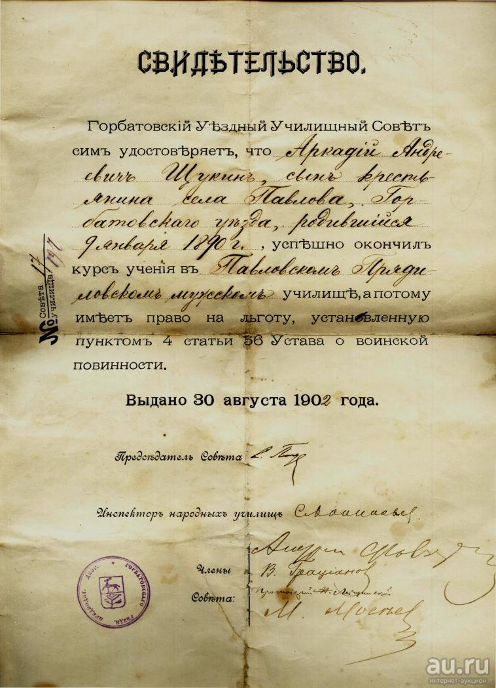
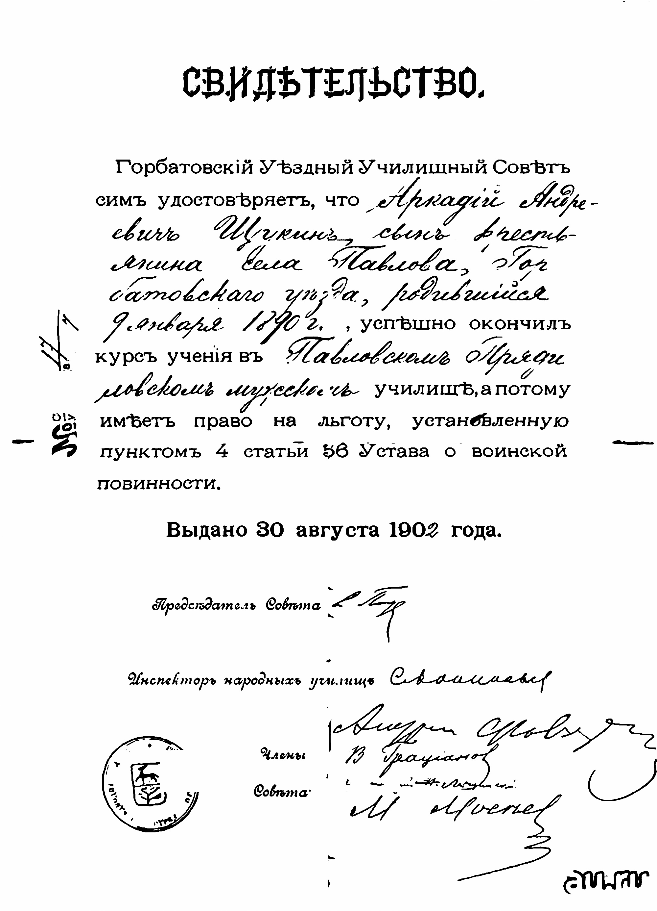
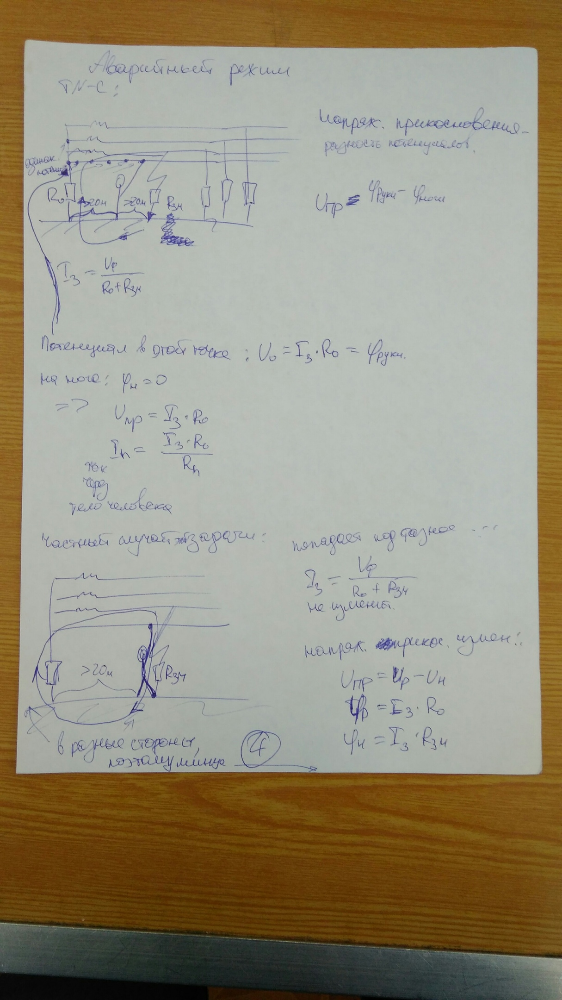
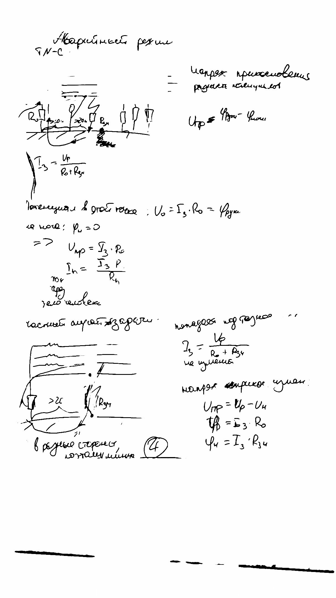

# robin


**robin** is a **RO**bust document image **BIN**arization tool, written in Python.

- **robin** - fast document image binarization tool;
- **metrics** - script for measuring the quality of binarization;
- **dataset** - links for DIBCO 2009-2018, Palm Leaf Manuscript and my own datasets with original and ground-truth images; scripts for creating training data from datasets and downloading imagest from [STSL](http://stsl.ru/);
- **articles** - selected binarization articles, that helped me a lot;
- **weights** - pretrained weigths for **robin**;

## Tech

**robin** uses a number of open source projects to work properly:
- [Keras](https://keras.io/) - high-level neural networks API;
- [Tensorflow](https://www.tensorflow.org/) - open-source machine-learning framework;
- [OpenCV](https://opencv.org/) - a library of programming functions mainly aimed at real-time computer vision;
- [Augmentor](https://augmentor.readthedocs.io/en/master/) - a collection of augmentation algorithms;

## Installation

**robin** requires [Python](https://www.python.org/) v3.5+ to run.

Get **robin**, install the dependencies from requirements.txt, download datasets and weights, and now You are ready to binarize documents!

```sh
$ git clone https://github.com/masyagin1998/robin.git
$ cd robin
$ pip install -r requirements.txt
```
## HowTo

#### Robin

**robin** consists of two main files: `src/unet/train.py`, which generates weights for U-net model from input 128x128 pairs of
original and ground-truth images, and `src/unet/binarize.py` for binarization group of input document images. Model works with 128x128 images, so binarization tool firstly splits input imags to 128x128 pieces. You can easily rewrite code for different size of U-net image, but researches show that 128 x 128 is the best size.

#### Metrics

You should know, how good is your binarization tool, so I made a script that automates calculation of four DIBCO metrics: F-measure, pseudo F-measure, PSNR and DRD: `src/metrics/metrics.py`. Unfortunately it requires two DIBCO tools: `weights.exe` and `metrics.exe`, which could be started only on Windows (I tried to run them on Linux with Wine, but couldn't, because one of their dependecies is `matlab MCR 9.0 exe`).

#### Dataset

It is realy hard to find good document binarization dataset (DBD), so here I give links to 3 datasets, marked up in a single convenient format. All input image names satisfy `[\d]*_in.png` regexp, and all ground-truth image names satisfy `[\d]*_gt.png` regexp.

- [**DIBCO**](https://yadi.sk/d/_91feeU21y3riA) - 2009 - 2018 competition datasets;
- [**Palm Leaf Manuscript**](https://yadi.sk/d/sMJxS3IGyTRJEA) - Palm Leaf Manuscript dataset from ICHFR2016 competition;
- [**Borders**](https://yadi.sk/d/p6R8kgPP98BZtw) - Small dataset containing bad text boundaries. It can be used with bigger **DIBCO** or **Palm Lead Manuscript** images;
- [**Improved LRDE**](https://yadi.sk/d/RwRVotFseCl2QA) - LRDE 2013 magazines dataset. I improved its ground-truths for better usage;

Also I have some simple script - `src/dataset/dataset.py` and `src/dataset/stsl-download.py`. First can fastly generate train-validation-testing data from provided datasets, second can be used for getting interesting training data from the Trinity-Sergius Lavra official site. It is expected, that you train your simple **robin** on marked dataset, then create new dataset with `stsl-download.py` and `binarize.py`, correct generated ground-truths and train **robin** again with these new pair of input and ground-truth images.

#### Articles

While I was working on **robin**, I constantly read some scientific articles. Here I give links to all of them.

- [**DIBCO**](https://yadi.sk/d/riAB5Fr4Tk5qPg) - 2009 - 2018 competition articles;
- [**DIBCO metrics**](https://yadi.sk/d/fO3KN21inP662g) - articles about 2 non-standard DIBCO metrics: pseudo F-Measure and DRD (PSNR and F-Measure is realy easy to find on the Web);
- [**U-net**](https://yadi.sk/i/5NligqxNbUPCYA) - articles about U-net convolutional network architecture; 
- [**CTPN**](https://yadi.sk/i/oiPxuN_a2a02Eg) - articles about CTPN - fast neural network for finding text in images (My Neural Network doesn't use it, but it is great and I began my researches from it);
- [**ZF_UNET_224**](https://yadi.sk/i/WbRq24jq0SsjGA) - I think, this is best U-net implementation in the world;

#### Weigths

Training neural network is not cheap, because you need powerful GPU and CPU, so I provide some pretrained weigths (For training I used two combinations: `Nvidia 1050 Ti 4 Gb + Intel Core I7 7700 HQ + 8 Gb RAM` and `Nvidia 1080 Ti SLI + Intel Xeon E2650 + 128 Gb RAM`).

- [**Base**](https://yadi.sk/d/cJYKi5P6Png3wA) - weights after training NN on `DIBCO` and `borders` data for 256 epochs with batchsize 128 and enabled augmentation. **IT IS TRAINED FOR A4 300 DPI Images, so Your input data must have good resolution**;

## Examples of work
- Old Orthodox document:

|       Original image           |          Binarized              |
|--------------------------------|---------------------------------|
|  |  |

- Checkered sheet:

|       Original image           |          Binarized              |
|--------------------------------|---------------------------------|
|  |  |

- Old evidence:

|       Original image           |          Binarized              |
|--------------------------------|---------------------------------|
|  |  |

- Magazine with pictures and bright text on dark background:

|       Original image           |          Binarized              |
|--------------------------------|---------------------------------|
|  |  |

## Bugs
- `Keras` has some problems with parallel data augmentation: it creates too many processes. I hope it will be fixed soon, but now it is better to use zero value of `--extraprocesses` flag (default value);

## Many thanks to:

- Igor Vishnyakov and Mikhail Pinchukov - my scientific directors;
- Chen Jian - DIBCO 2017 article finder;

## Referenced or mentioned by:

- [ICDAR 2019 Competition on Image Retrieval for Historical Handwritten Documents](https://arxiv.org/pdf/1912.03713.pdf)
- [Amandus Krantz. Cluster-based Sample Selection for Document Image Binarization](http://www.diva-portal.org/smash/get/diva2:1335424/FULLTEXT02)
- [Jakob Ahrneteg, Dean Kulenovic. Semantic Segmentation of Historical Document Images Using Recurrent Neural Networks](https://pdfs.semanticscholar.org/2d1f/3795a650b56877044afb9248db65021df09d.pdf)
